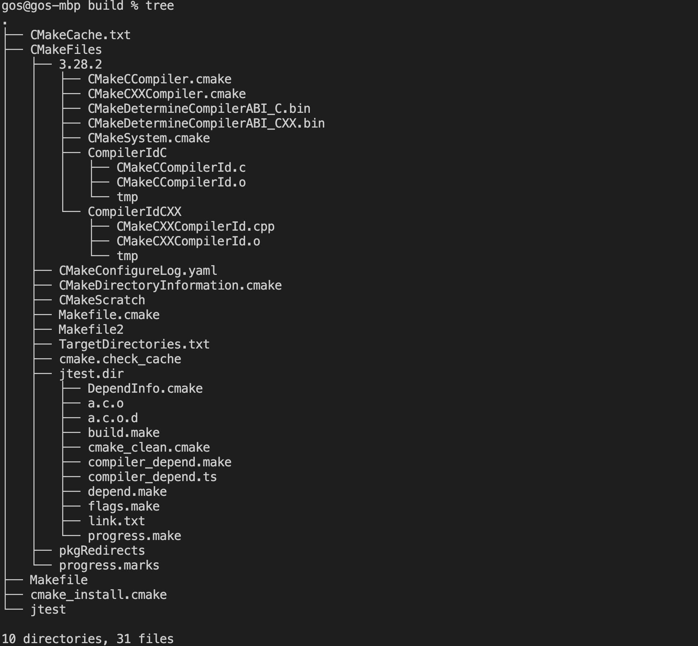

# Cmake

### Initialising

+ CMakeLists.txt
+ Makefile

### Building

```bash
# Build configuration setup
cmake -S <source path> -B <build path>
```

Build directory structure:


```bash
# In build folder, 
$ make  # This command runs the makefile
```

### Run Project

### CMakeLists.txt

```cmake
cmake_minimum_required(VERSION 3.20) # Defining the minimum version of CMake required
project(tutorial) # Set project name

set(CMAKE_CXX_STANDARD 11) # Specify the C++ standard (or C standard)

```
