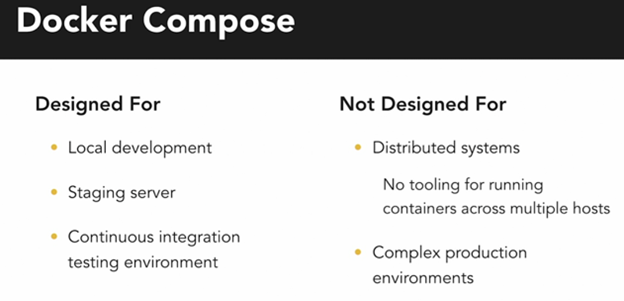

# Docker

<pre>Docker is an open source platform that enables developers to build, deploy, run, update and manage containerized applications.</pre>

-----------------------------

## Commands

+ Fetching currently running containers

    ```bash
    docker ps
    ```

+ Fetching all containers

    ```bash
    docker ps -a
    ```

+ To build the image with a tag

    ```bash
    docker build -t <tag> <loc>
    ```

  + -t indicates tag
  + < loc > is the location of dockerfile

+ To run the image

    ```bash
    docker run -p <lport>:<cport> <tag>
    ```

  + -p indicates linking the containers' port to local port

+ To pull the in-built image

    ```bash
    docker pull <image-name>
    ```

+ To stop running container

    ```bash
    docker stop <name>
    ```

+ To remove container

    ```bash
    docker rm <name>
    ```

+ To remove image

    ```bash
    docker rmi <image-name>
    ```

+ To run in background (as a daemon)

    ```bash
    docker run -d <name>
    ```

+ To connect  to the running container

    ```bash
    docker attach <first_few_digits_of_id>
    ```

+ Interactive & Terminal attach for taking inputs

    ```bash
    docker run -it <name>
    ```

+ Mapping the containers' volume to local repo as a backup

    ```bash
    docker run -v <ldir>:<volume> <name>
    #             (or)
    docker run --mount type=bind,source=<ldir>,target=<volume> <name>
    ```

  + Eg:

    ```bash
    docker run -v /opt/datadir:/var/lib/mysql mysql
    #           (or)
    docker run --mount type=bind,source=/opt/datadir,target=/var/lib/mysql mysql
    ```

+ Creating Volumes

    ```bash
    docker volume create <name>
    ```

+ Fetching all the details of a conatiner (in json format)

    ```bash
    docker inspect <name>
    ```

+ textTo see the logs of background running containers

    ```bash
    docker logs <name>
    ```

+ To set environmental variables

    ```bash
    docker run -e <variable>=<value> <name>
    ```

+ Linking other applications

    ```bash
    docker run --link <name>:<name> <app-name>
    #   (or)
    docker run --link=<name> <app-name>
    ```

+ Running containers on a docker engine present in different host

    ```bash
    docker -H=<ip_address> run <name>
    ```

  + Eg:

    ```bash
    docker -H=10.123.2.1:2325 run nginx
    ```

+ Restricting the amount of resources a container can use

    ```bash
    docker run --cpus=<float_value(percent)> <name> # for limiting cpu 

    docker run --memory=<memory_limit> <name> # for limiting storage
    ```

### Docker Networking

**By default 3 networks**

+ *Bridge:* ports are attached to default bridge network (usually 172.17.00 series).
+ *None:* no port mapping.
+ *Host:* no need of mapping; ports are directly attached to the Host network.

+ Specifying the network for a container

    ```bash
    docker run --network=<network_name> <name>
    ```

+ Creating network

    ```bash
    docker network create --driver bridge --subnet 182.18.0.1/24 --gateway 182.18.0.1 <name>
    ```

+ Display all network

    ```bash
    docker network ls
    ```

> Docker has a built-in embedded DNS server that maps the containers' name to its ip address

--------------

## Dockerfile

```Dockerfile
# Start with a base image containing Go runtime
FROM golang:latest

# Set the Current Working Directory inside the container
WORKDIR /go/src/app

# Copy everything from the current directory to the PWD (Present Working Directory) inside the container
COPY . .

# Download all dependencies. Dependencies will be cached if the go.mod and go.sum files are not changed
RUN go mod download

# Build the Go app
RUN go build -o main .

# Expose port 8080 to the outside world
EXPOSE 8180

# Command to run the executable
CMD ["./main"]

```

<pre>ENTRYPOINT & CMD --> used for commands; entrypoint is startup command & cmd is appended to it if no command is given in<br>command-line (like default)
</pre>

------------------------

## Docker Compose

<pre>Docker Compose is a tool for defining and running multi-container applications. It is the key to unlocking a streamlined<br>and efficient development and deployment experience.</pre>

<!--  -->


```yaml
version: '3.8'

services:
  web:
    image: nginx:alpine
    ports:
      - "8080:80"
    volumes:
      - ./nginx.conf:/etc/nginx/nginx.conf:ro
    depends_on:
      - backend
    networks:
      - app-network

  backend:
    image: node:14
    volumes:
      - ./backend:/app
    working_dir: /app
    command: "npm start"
    env_file:
      - .env
    depends_on:
      - db
    networks:
      - app-network

  db:
    image: postgres:13
    volumes:
      - db-data:/var/lib/postgresql/data
    env_file:
      - .env
    networks:
      - app-network

volumes:
  db-data:

networks:
  app-network:

```
