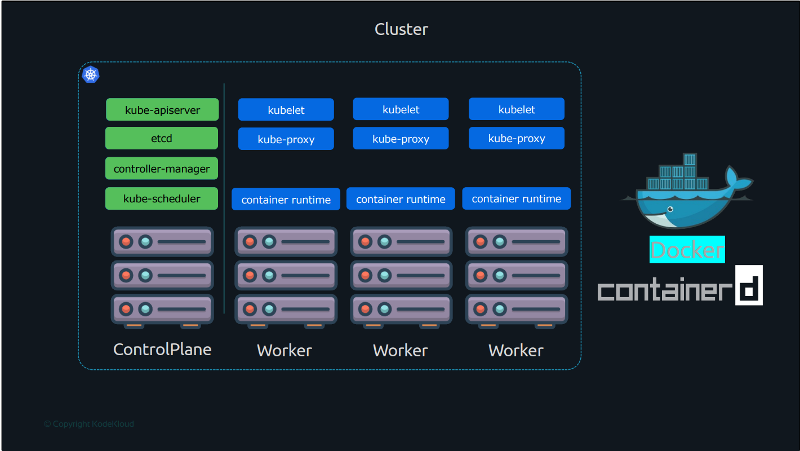
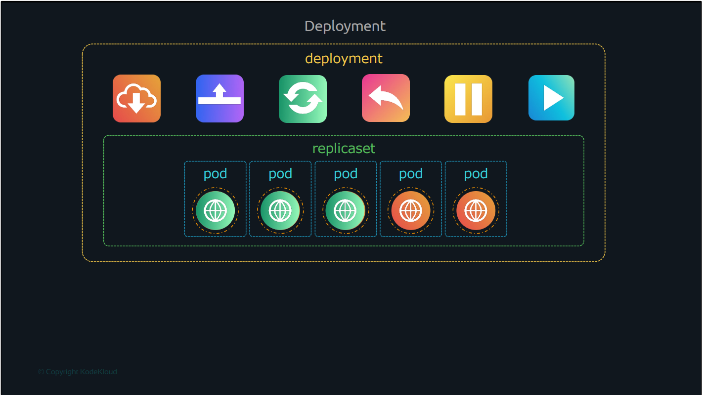
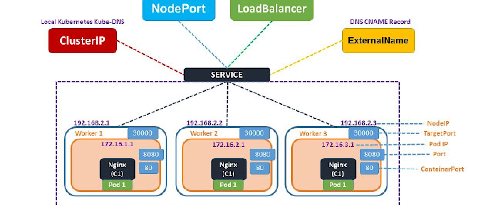

# Kubernetes

<pre>Kubernetes is an open-source container orchestration system for automating software deployment, scaling, and management.</pre>

------

## Commands

+ Fetching version

    ```bash
    kubectl version
    ```

+ Fetching details of types (Pods, Services, Deployments, ReplicaSets)

    ```bash
    kubectl get <type>
    ```

+ Fetching details of all objects

    ```bash
    kubectl get all
    ```

+ fetching pods with more details(including ip addresses)

  ```bash
  kubectl get pods -o wide
  ```

+ Running a pod

    ```bash
    kubectl run <name> --image=<image_name>
    ```

+ Creating an object using a yaml file

    ```bash
    kubectl create -f <file_name>
    ```

+ Update or Apply Changes

    ```bash
    kubectl apply -f <file_name>
    #           (or)
    kubectl replace -f <file_name>
    ```

+ Fetching details of particular object

    ```bash
    kubectl describe <type> <name>
    ```

+ Scaling the objects

    ```bash
    kubectl scale --replicas=6 <type> <name>
    ```

+ Deleting

    ```bash
    kubectl delete <type> <name>
    ```

+ Updating the properties in YAML format

    ```bash
    kubectl edit <type> <name>
    ```

## YAML Definitions

### Pod definitions

```yaml
apiVersion: v1
kind: Pod
metadata:
  name: my-pod
  labels:
    app: my-app
spec:
  containers:
    - name: my-container
      image: nginx:latest
      ports:
        - containerPort: 80

```

### ReplicaSet definitions

```yaml
apiVersion: apps/v1
kind: ReplicaSet
metadata:
  name: example-replicaset
  labels:
    app: my-app
spec:
  replicas: 3
  selector:
    matchLabels:
      app: my-app
  template:
    metadata:
      labels:
        app: my-app
    spec:
      containers:
      - name: my-container
        image: nginx:latest
        ports:
        - containerPort: 80

```

### Deployment definitions

```yaml
apiVersion: apps/v1
kind: Deployment
metadata:
  name: my-deployment
spec:
  replicas: 3
  selector:
    matchLabels:
      app: my-app
  template:
    metadata:
      labels:
        app: my-app
    spec:
      containers:
        - name: my-container
          image: nginx:latest
          ports:
            - containerPort: 80

```

### Service definitions

```yaml
apiVersion: v1
kind: Service
metadata:
  name: my-service
spec:
  selector:
    app: my-app
  ports:
    - protocol: TCP
      port: 80
      targetPort: 80
  type: ClusterIP

```

**Types:** *ClusterIP, NodePort, LoadBalancer*

*Explained about **Services** in detail [Here](https://www.zippyops.com/kubernetes-services-explained)*






