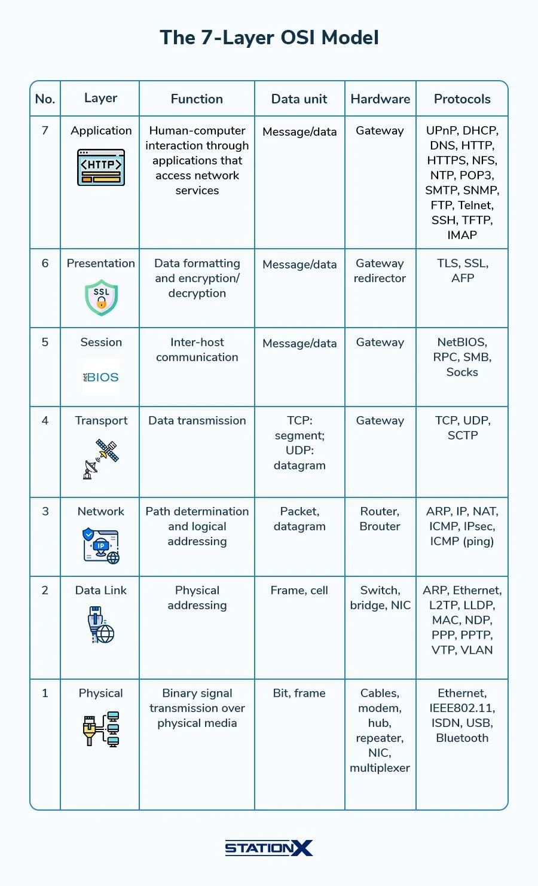
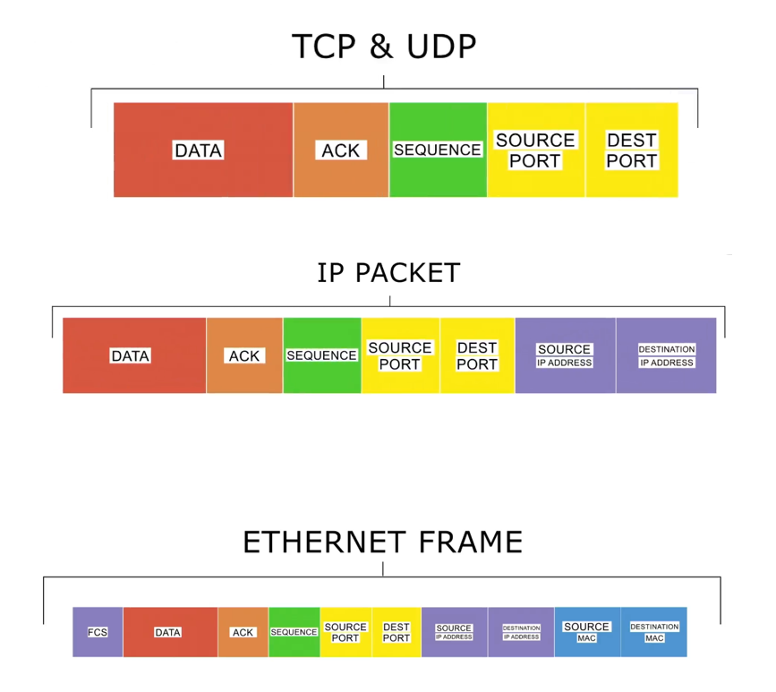
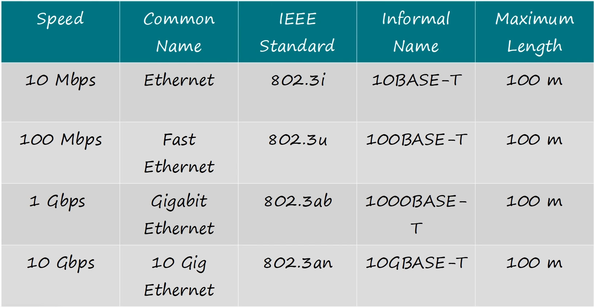
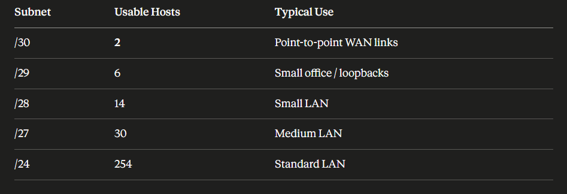
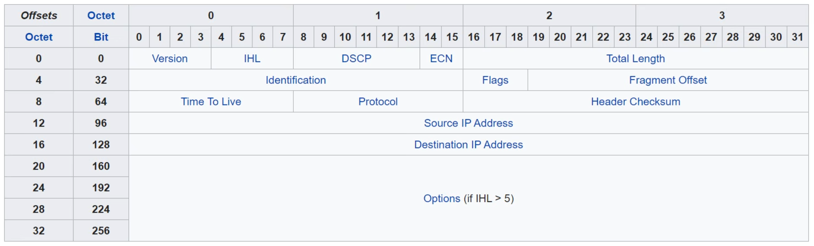
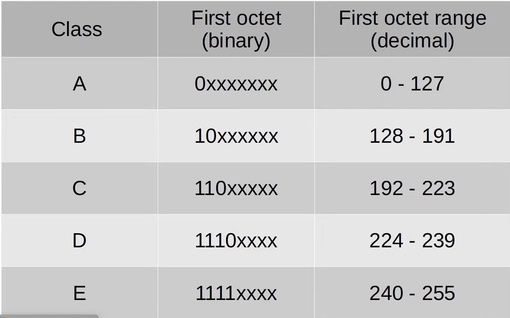
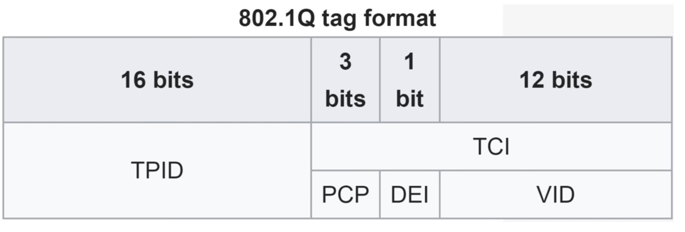

# Networks

## OSI Layers

## Traditional RPC

## GRPC

## Layers

### L1

**Bits & Bytes**
1 byte = 8 bits

- For packets, Speed is always measure in *bits per second* (Kbps, Mbps, Gbps)
- But anyhow, Data on hardrive is measured in *Bytes per second* (KBps, MBps, GBps)

**Ethernet** (*IEEE 802.3*)
Types of Ethernet Connectors:

1. RJ45(Registered Jack 45)(port type) - Copper cable (UTP - Unshielded Twisted Pair)

2. SFP (Small Form-factor Pluggable)(port type) - Fiber Optic - Glass cable

### L2

**MAC Address** (Media Access Control)

- 48 bits (6 bytes) long
- Written in Hexadecimal (base 16)
- Unique for each network interface card (NIC)
- Format: `XX:XX:XX:XX:XX:XX` (e.g., `00:1A:2B:3C:4D:5E`)

**Switches** operate at Layer 2 (Data Link Layer) and use MAC addresses to forward data frames within a local area network (LAN).

- When a switch receives a data frame, it reads the destination MAC address and forwards the frame to the appropriate port based on its MAC address table.
- If the destination MAC address is not in the switch's MAC address table, it will broadcast the frame to all ports except the one it was received on, which can lead to network congestion.

**Address Resolution Protocol (ARP)** is used to map IP addresses to MAC addresses within a local network.

- When a device wants to communicate with another device on the same network, it sends an ARP request to find out the MAC address associated with the destination IP address.
- The device with the matching IP address responds with an ARP reply, providing its MAC address, allowing the sender to update its ARP cache and send the data frame to the correct destination.

### L3

**IP Address** (Internet Protocol Address)

- 32 bits (4 bytes) long for IPv4, 128 bits (16 bytes) long for IPv6
- Written in decimal (IPv4) or hexadecimal (IPv6) format
- The `/24` notation represents the subnet mask, indicating that the first 24 bits of the IP address are used for the network portion.

> `/32` is the subnet mask for a single host, meaning that all 32 bits are used for the host portion of the IP address.
> `x.x.x.0` will be gateway address for the network, and `x.x.x.255` will be broadcast address for the network.
> `/30` is the subnet mask for a point-to-point link, meaning that 30 bits are used for the network portion and 2 bits are used for the host portion, allowing for 2 usable IP addresses on the link.
<!-- >  -->

**Routers** operate at Layer 3 (Network Layer) and use IP addresses to forward data packets between different networks.

- When a router receives a data packet, it reads the destination IP address and forwards the packet to the appropriate next hop based on its routing table.

#### IPv4 Header

- Version: 4 bits (IPv4-`0100`, IPv6-`0110`)
- Header Length: 4 bits (number of 32-bit words in the header, minimum is 5 for IPv4)
  - Min Value: `0101` (5 in decimal, which is 20 bytes)
  - Max Value: `1111` (15 in decimal, which is 60 bytes)
- Total Length: 16 bits (total length of the IP packet, including header and data, in bytes)
- DSCP: 6 bits (Differentiated Services Code Point, used for Quality of Service)
- ECN: 2 bits (Explicit Congestion Notification)
- Protocol: 8 bits (indicates the protocol used in the data portion)
  - TCP: `6`
  - UDP: `17`
  - ICMP: `1`
  - HTTP: `80`
  - HTTPS: `443`
  - DNS: `53`
  - OSPF: `89`
  - BGP: `179`
  - IPsec: `50` (ESP), `51` (AH)
  - ISIS: `124`
  - IPv4: `4`
  - IPv6: `41`
  - No Next Header (IPv6): `59`
  - [List of IP Protocol Numbers](https://www.iana.org/assignments/protocol-numbers/protocol-numbers.xhtml)
- MTU (Maximum Transmission Unit): The largest size of a packet that can be transmitted over a network medium, typically 1500 bytes for Ethernet.
- TTL (Time to Live): 8 bits (indicates the maximum number of hops a packet can take before being discarded, decremented by each router it passes through)

#### IP Subnetting

IP subnetting is the process of dividing a larger network into smaller, more manageable sub-networks, or subnets. This allows for better utilization of IP addresses and improved network performance and security.

**Classful Subnetting**

**Classless Inter-Domain Routing (CIDR)**

CIDR notation is a method for allocating IP addresses and routing IP packets. It replaces the older system based on classes A, B, and C. CIDR allows for more efficient use of IP addresses by enabling variable-length subnet masking (VLSM).

**VLSM (Variable Length Subnet Masking)**
VLSM allows network administrators to divide an IP address space into subnets of different sizes, optimizing the allocation of IP addresses based on the specific needs of each subnet. This flexibility helps conserve IP addresses and improve network efficiency.

*Steps to calculate subnets using VLSM:*

1. Determine the total number of required subnets and hosts per subnet.
2. Assign the largest subnet at the start of the address space.
3. Assign the second largest subnet next, and so on, until all subnets are allocated.

### VLANs

***Broadcast Domain***

A **broadcast domain** is the group of devices on a network segment that can receive broadcast frames(destination MAC `FF:FF:FF:FF:FF:FF`) from each other. Broadcast frames are sent to all devices within the same broadcast domain, and they are typically used for network discovery and communication.

A router separates broadcast domains, meaning that devices on different broadcast domains cannot directly communicate with each other using broadcast frames. This helps to reduce network congestion and improve performance by limiting the scope of broadcast traffic.

***LAN***
A *LAN* is a single broadcast domain, including all devices connected to the same switch or set of interconnected switches.

> > > > > > > > > > > > > > > > > ---

***VLANs***
VLANs (Virtual Local Area Networks) allow network administrators to segment a physical network into multiple logical networks at Layer 2. This can improve security and reduce broadcast traffic by isolating different groups of devices within the same physical infrastructure.

VLANs are configured on switches and are identified by a VLAN ID (VID). Devices within the same VLAN can communicate with each other as if they were on the same physical network, even if they are connected to different switches.

Switches do not forward traffic directly between hosts on different VLANs. *(To enable communication between VLANs, a router or a Layer 3 switch is required to route traffic between the VLANs.)*

> - An access port is a switch port that is assigned to a single VLAN and carries traffic for that VLAN only.
> - Switchports that carry multiple VLANs are called ***Trunk ports***. Trunk ports use tagging protocols (such as IEEE 802.1Q) to identify which VLAN each frame belongs to, allowing multiple VLANs to share the same physical link.

#### VLAN Tagging

> **Trunk Port** = *Tagged Port*
> **Access Port** = *Untagged Port*

VLAN tagging is a method used to identify which VLAN a particular Ethernet frame belongs to when it is transmitted over a trunk link. This is essential for allowing multiple VLANs to share the same physical network infrastructure while maintaining logical separation between them.

- **IEEE 802.1Q**: It inserts a 4-byte tag into the Ethernet frame header, which includes the VLAN ID and priority information.
- The VLAN ID allows switches to determine which VLAN the frame belongs to, while the priority information can be used for Quality of Service (QoS) purposes.

- The tag consists of the following fields:
  - **Tag Protocol Identifier (TPID)**: 16 bits, set to `0x8100` to indicate that the frame is VLAN-tagged.
  - **Tag Control Information (TCI)**: 16 bits, which includes the Priority Code Point (PCP), Drop Eligible Indicator (DEI), and VLAN Identifier (VID).
      1. *Priority Code Point (PCP)*: 3 bits, used for QoS prioritization.
      2. *Drop Eligible Indicator (DEI)*: 1 bit, indicates whether the frame can be dropped in case of congestion.
      3. *VLAN Identifier (VID)*: 12 bits, specifies the VLAN to which the frame belongs (values range from 0 - 4095, with `0` and `4095` reserved).

**Native VLAN**: The default VLAN on a switch port, which is used for untagged traffic. By default, the native VLAN is VLAN 1, but it can be changed to any other VLAN as needed.

**ROAS (Router on a Stick)**: A network configuration where a single physical router interface is used to route traffic between multiple VLANs. This is achieved by configuring sub-interfaces on the router, each associated with a different VLAN and using 802.1Q tagging to differentiate the traffic.
Eg: If a router has a single physical interface (e.g., `GigabitEthernet0/0`), it can be configured with sub-interfaces like `GigabitEthernet0/0.10` for VLAN 10, `GigabitEthernet0/0.20` for VLAN 20, and so on. Each sub-interface is assigned an IP address corresponding to its VLAN, allowing the router to route traffic between the VLANs.
