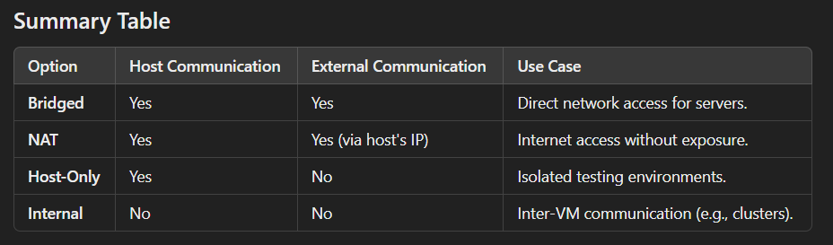

# Virtual Machines

This is the page that has some info about VMs and their utils*

## Network Connection Options in VM

When creating a Virtual Machine (VM), you typically encounter four main network connection options. These determine how the VM communicates with the host machine and external networks. Here's an explanation of each:

### 1. __Bridged Networking__

- How it Works: The VM acts as a separate physical machine on the same network as the host. It gets its own IP address from the network (e.g., DHCP server).
- Use Case: Ideal for scenarios where the VM needs direct access to the external network, like web servers or file sharing.
- Pros:
  - VM is fully accessible to other devices on the same network.
  - Can use network services like DHCP or DNS directly.
- Cons:
  - Requires proper network permissions.
  - Might expose the VM to external threats.

### 2. __NAT (Network Address Translation)__

- How it Works: The VM shares the host's IP address and uses NAT to communicate with external networks. The VM is on an internal private network.
- Use Case: Suitable for general internet access without exposing the VM to the local network.
- Pros:
  - Easy setup with minimal configuration.
  - Provides some isolation from the external network.
- Cons:
  - VM cannot be directly accessed from the external network.
  - Port forwarding is needed for specific services.

### 3. __Host-Only Networking__

- How it Works: The VM can only communicate with the host machine and other VMs on the same host. No access to the external network.
- Use Case: Useful for testing, debugging, or secure development environments without internet or external access.
- Pros:
  - Provides complete isolation from external networks.
  - Useful for private communication between host and VMs.
- Cons:
  - No internet access or communication with external networks.

### 4. Custom/Private Network or Internal Networking

- How it Works: Creates a private internal network where VMs can communicate with each other but not with the host or external networks.
- Use Case: Best for multi-VM setups where inter-VM communication is needed, like simulating clusters or complex systems.
- Pros:
  - Isolated environment for VM-to-VM communication.
  - Does not interfere with external networks.
- Cons:
  - No communication with the host or internet.

