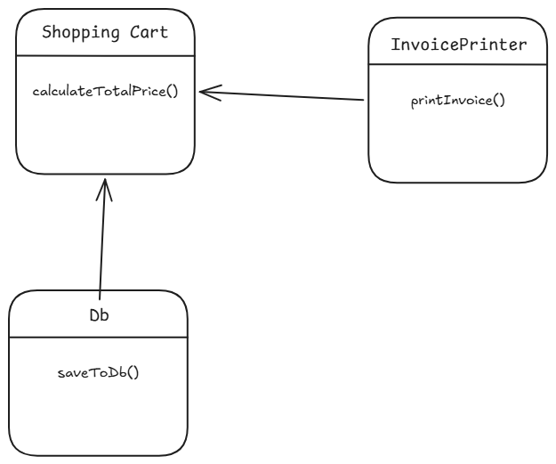
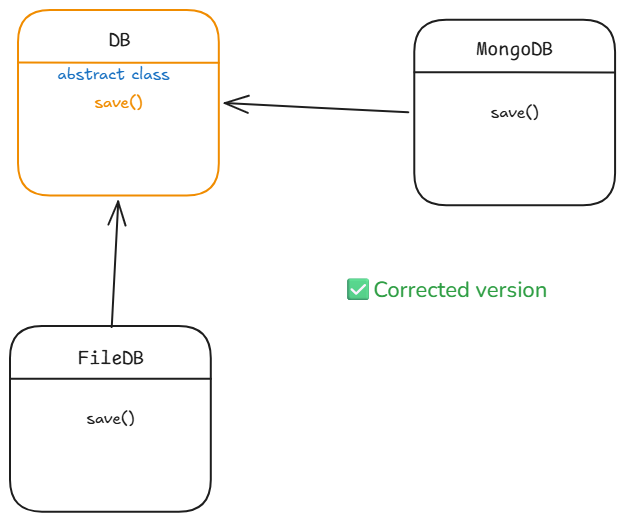

# SOLID Principles

***SOLID principles** prevent software from becoming brittle, complex, and expensive to maintain as it grows. Without them, small changes in one part of the codebase often break unrelated features.*

## **Single Responsibility Principle (SRP)**

A class should have only one reason to change, meaning it should have only one job or responsibility.

```cpp
Class ShoppingCart {
    public:
        void addItem(Item item);
        void removeItem(Item item);
        double calculateTotal();
        void printInvoice(); // This violates SRP
        void saveToDatabase(); // This violates SRP
};
```

Corrected version:



## **Open/Closed Principle (OCP)**

Software entities (classes, modules, functions, etc.) should be open for extension but closed for modification. This means you should be able to add new functionality without changing existing code.

```cpp
void dbStorage(){
    // code to store data in a database
    saveToMongoDB();
    saveToMySQL(); // This violates OCP because we have to modify this function to add new storage types
    saveToFile(); // This violates OCP because we have to modify this function to add new storage types
}
```



## **Liskov Substitution Principle (LSP)**

Subtypes must be substitutable for their base types. This means that objects of a derived class should be able to replace objects of the base class without affecting the correctness of the program.

```cpp
class Bird {
    public:
        virtual void fly() = 0;
};

class Duck : public Bird {
    public:
        void fly() override {
            // Duck can fly
        }
};

class Ostrich : public Bird {
    public:
        void fly() override {
            // Ostrich cannot fly, this violates LSP
        }
};
```

Corrected version:

```cpp
class Bird {
    public:
        virtual void move() = 0;
};

class Duck : public Bird {
    public:
        void move() override {
            // Duck can fly
        }
};

class Ostrich : public Bird {
    public:
        void move() override {
            // Ostrich can run
        }
};
```
